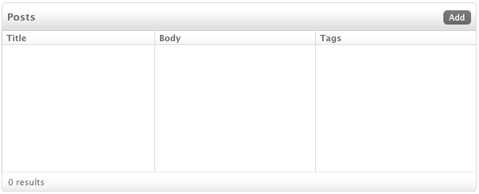
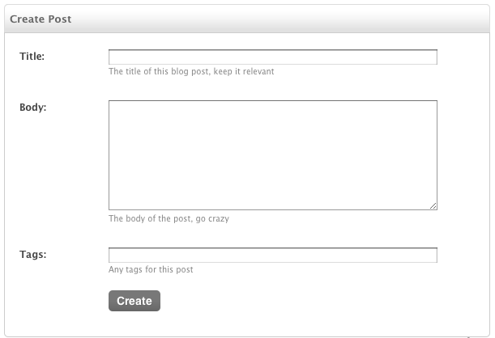
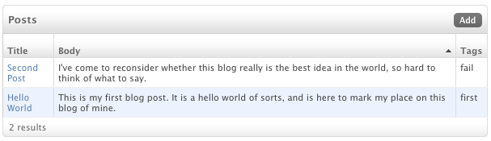
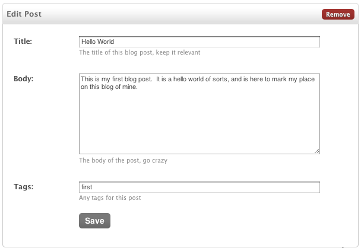

QuickStart
===============

Here's a simple example of Smartmin with a very simple model to show you how it works.  You can find out more details on each of these features in the appropriate sections but this is a good overview given a simple model.

For this example, we are going to use the ubiquitous blog example.  We'll simply add a way for authenticated users to create a blog post, list them, edit them and remove them.

To start out with, let's create our app::

   python manage.py startappp blog

Don't forget to add the app to your ``INSTALLED_APPS`` in ``settings.py``.

Now, let's add a (deliberately simple) Post object to our newly created ``models.py``::

  from django.db import models

  class Post(models.Model):
      title = models.CharField(max_length=128,
                               help_text="The title of this blog post, keep it relevant")
      body = models.TextField(help_text="The body of the post, go crazy")
      tags = models.CharField(max_length=128,
                              help_text="Any tags for this post")

Ok, so far, this all normal Django stuff.  Now let's create some views to manage these Post objects.  This is where Smartmin comes in.

Smartmin provides a controller that lets you easily hook up Create, Read, Update, Delete and List views for your object.  In Smartmin, we call this CRUDL, and we call the helper class that defines it a SmartCRUDL.  So in our ``views.py`` let's create a CRUDL for our Post object::

  from smartmin.views import *
  from .models import *

  class PostCRUDL(SmartCRUDL):
      model = Post

You'll see that right now, all we are doing is defining the model that our CRUDL is working with.  Everything else is using defaults.

Finally, we'll have to create a ``urls.py`` for our app, and hook in this CRUDL::

  from .views import *

  urlpatterns = PostCRUDL().as_urlpatterns()

Again, Smartmin keeps this very, very, DRY.  The urls (and reverse patterns) are created automatically using standard Django conventions and the name of our model.  The last part is you'll need to add this urls.py to your global ``urls.py``::

  urlpatterns = patterns('',
    # .. other url patterns
    url(r'^blog/', include('blog.urls')),
  )

With a quick ``python manage.py syncdb`` that should be it.  You should be able to start your server and hit the index for your CRUDL object at ``http://localhost:8000/blog/post/`` and get a view that looks like this:

You'll notice that CRUDL has no only wired up the views, but given us a standard list view by default.  If we click on the 'add' button, we'll get the default Create view for our object:

If we add a few items, we'll see our list displays things appropriately:

We can click on any of the items to edit them, and when editing, and from there even remove them if needed:

And that's it.  You probably want to learn how to customize things, either at the CRUDL layer or on each individual view.

